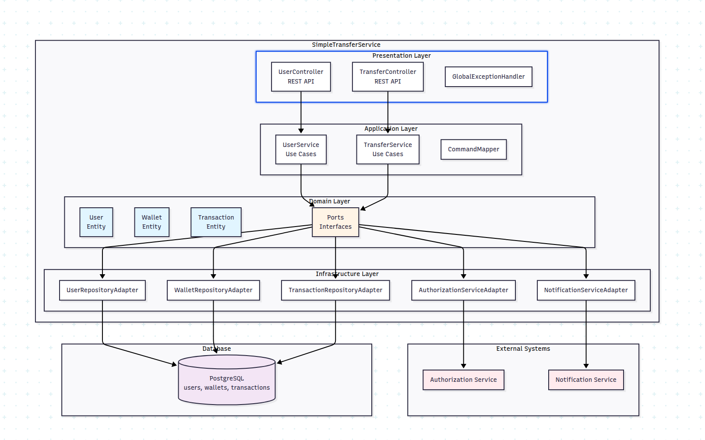

# Simple Transfer Service

# Overview

- [Visão Geral](#-visão-geral)
- [Tecnologias Utilizadas](#-tecnologias-utilizadas)
- [Funcionalidades](#-funcionalidades)
- [Instalação e Execução](#-instalação-e-execução)
- [API Endpoints](#-api-endpoints)
- [Arquitetura](#-arquitetura)
    - [Motivações e Decisões](#motivações-e-decisões-arquiteturais)
    - [Diagramas](#diagramas)
    - [Design Patterns Utilizados](#design-patterns-utilizados)
    - [Controle de Concorrência](#-controle-de-concorrência)
- [Decisões Técnicas](#-decisões-técnicas-adrs)
- [Máquina de Estados](#-máquina-de-estados-de-transações)
- [Testes](#-testes)
- [Melhorias Futuras](#-melhorias-futuras)

# Visao Geral

O **Simple Transfer Service** e um microservico desenvolvido em Java com Spring Boot que permite a realizacao de
transferencias financeiras entre contas de usuarios (CUSTOMER ou MERCHANT).
O sistema garante a integridade e consistencia dos dados atraves do uso de transacoes ACID e controle de concorrencia.

# Funcionalidades

- Cadastro de usuarios (tipo CUSTOMER ou MERCHANT) e suas carteiras associadas.
- Transferencia as financeiras entre carteiras de usuarios (CUSTOMER -> MERCHANT ou CUSTOMER -> CUSTOMER).
- Validação de saldo suficiente antes de realizar transferencias.
- Registro de transacoes com estados (PENDING, COMPLETED, FAILED).
- Reversao de falhas na transacao (REVERSED) em caso de erros.
- Autorizacao atraves de servico exterrno.
- Notificacao do usuario apos a conclusao da transferencia.

# Tecnologias Utilizadas

- Java 21.
- Spring Boot e libs relacionadas (Spring Data JPA, Spring Web).
- Resilience4j para retry e circuit breaker.
- PostgreSQL como banco de dados relacional.
- Docker para conteinerizacao.
- Flyway para migracoes de banco de dados.
- JUnit e Mockito para testes unitarios e de integracao.
- Testcontainers para testes de integracao com banco de dados.
- Lombok para reduzir boilerplate code.
- Gradle como sistema de build.

# Instalacao e execucao

Clone o repositorio:

```bash
git clone  
```

no diretorio do projeto, construa a imagem Docker ou suba o servico localmente:

```bash
docker build -t simple-transfer-service .
# ou 
docker compose up --build
```

Caso queira, rode localmente com gradle suba o container do postgreSQL primeiro

```bash
# suba o container do postgres
docker compose up -d postgres
# suba com gradle
./gradlew bootRun
```

Outros comandos

```bash

./gradlew test 
./gradlew jacocoTestReport

```

O servico ficara disponivel em `http://localhost:8080`.

# API Endpoints

- `POST /api/v1/users` - Cria um novo usuario com uma carteira/saldo associado.
- `GET /api/v1/users/documet` - Recupera detalhes de um usuario pelo número de documento.
- `GET /api/v1/users/email` - Recupera detalhes de um usuario pelo email.
- `POST /api/v1/transfers` - Inicia uma transferencia entre usuarios.

## Exemplos de chamadas

```bash
## cria usuario do tipo MERCHANT
curl -X POST --location "http://localhost:8080/api/v1/users" \
    -H "Content-Type: application/json" \
    -d '{
          "fullName": "Marcos MERCHANT",
          "documentNumber": "39293399866",
          "email": "mviniciusjunqueiramerchant@gmail.com",
          "password": "8462862",
          "userType": "MERCHANT",
          "initialBalance": "1000.00"
        }'
## cria usuario do time CUSTOMER
curl -X POST --location "http://localhost:8080/api/v1/users" \
    -H "Content-Type: application/json" \
    -d '{
          "fullName": "Marcos CUSTOMER",
          "documentNumber": "39293399866",
          "email": "mviniciusjunqueira@gmail.com",
          "password": "8462862",
          "userType": "CUSTOMER",
          "initialBalance": "1000.00"
        }'
## busca usuario por documento
curl -X GET --location "http://localhost:8080/api/v1/users/document?documentNumber=39293399866"
##  busca usuario por email
curl -X GET --location "http://localhost:8080/api/v1/users/email?email=mviniciusjunqueiramerchant%40gmail.com"

## realiza transferencia entre usuarios
curl -X POST --location "http://localhost:8080/api/v1/transfers" \
    -H "Content-Type: application/json" \
    -d '{
          "payerId": 6,
          "payeeId": 7,
          "value": 100
        }' 
``` 

### Validacoes

- O usuario pagador (payer) deve ser do tipo CUSTOMER.
- O usuario recebedor (payee) pode ser do tipo CUSTOMER ou MERCHANT.
- O saldo do pagador deve ser suficiente para cobrir o valor da transferencia.
- Os usuarios envolvidos na transferencia devem existir no sistema.
- Os usuarios envolvidos na tranferencia não podem ser o mesmo usuario.
- A autorizacao da transferencia e feita por um serviço externo simulado.
- Em caso de falha da autorizacao, a transferencia e cancelada.
- Em caso de falha na transferencia, o sistema tenta reverter a operacao para manter a consistencia dos dados.
- Notificacao e enviada ao usuario apos a conclusao da transferencia, seja ela bem sucedida ou nao.

# Arquitetura

## Estudo do problema e arquitetura

Neste estudo, vamos evoluir a arquitetura em passos. Inicialmente, iremos com a versão mais "simples". Nessa versão
simplificada, proponho uma implementação simples para entendermos ou aproximar dos possíveis problemas do
domínio.

Na versão proposta, que serviu de base para a implementação, sugiro melhorias e otimizações para problemas identificados
na implementação simplificada. Lembre-se de que não necessariamente encontraremos esses problemas no mundo real, mas uma
implementação assim nos deixa mais seguros e protegidos desde o início.

Nesta versao simplificada, temos a seguinte arquitetura:


- O endpoint de transferência é definido pelo `transferController`, que delega o comando de transferência ao
  `TransferService`.
- O `TransferService` é responsável por:
    - Autorizar a transferência
    - Atualizar os dados bancários no banco de dados
    - Notificar os envolvidos
- O `AuthorizationService` lida com a comunicacao com serviço externo de autenticacao.
- O `NotificationService` se comunica com o serviço externo de notificacao.
- **Problema #1**: temos uma chamada **bloqueante** ao serviço de autorizacao, nesse caso podemos ter os seguintes
  problemas:
    - Servico externo indisponivel: trava o fluxo de transferencia.
    - Serviço externo intermitente: adiciona latencia na chamada e ao usuario.
- **Problema #2**: temos uma chamada ao banco de dados depois da autorizacao, isso nos causa problemas de concorrencia.
- **Problema #3**: mesmo problema de chamada bloqueante e uma falha nesse processo, pode nos exigir um rollback (por
  estar
  fortemente acoplado)
- **Problema #4**: Temos um problema de **Read-Writers(**https://www.baeldung.com/cs/readers-writers-problem), do qual
  tempos uma leitura seguida de uma escrita. Nesse caso lemos o saldo do usuario e existindo saldo suficiente, fazemos
  a transferencia para outro usuario (escrita no banco). Por exemplo, duas threads podem ler em diferentes tempos e a
  primeira desconta do usuario, enquanto a segunda tambem vai descontar do usuario, ocasionando um saldo negativo
  pela mesma transacao.

Além desses, temos outros problemas:

- Arquitetura simples que não permite evoluções dado o alto acomplamento entre os serviços.
- Problemas de dependencia a implementacao: preso a um tipo de banco de dados dado o `TransferService` lida
  diretamente com a persistencia.
- Problemas de escalabilidade por ser chamadas bloqueantes e uma dependencia de serviços externos, o nosso teto de
  desempenho sempre vai ser o limite desses serviços (que podem ter rate limiters).

## Motivacao e Decisoes Arquiteturais

Dados os problemas listados acima, podemos pensar em algumas solucoes arquiteturais para mitigar esses problemas. No
caso
sugiro utilizarmos um **Arquitetura Hexagonal** (Ports and Adapters) para desacoplar as dependencias e permitir uma
maior flexibilidade na escolha das tecnologias. Para referencias sobre arquitetura hexagonal,
veja: https://alistair.cockburn.us/hexagonal-architecture. Nesta arquitetura, podemos trocar nossas dependencias e
implementacoes (ex: PostgreSQL por MongoDB,
RabbitMQ, etc) sem impactar o dominio do sistema.

Na arquitetura proposta, temos os seguintes componentes:


Na arquitetura hexagonal, temos os seguintes componentes:

- **Domain**: Contém as regras de negócio e entidades do sistema. É independente de qualquer tecnologia ou framework.
- **Ports**: Define as interfaces que o domínio expõe para o mundo externo (ex: repositórios, serviços externos).
- **Adapters**: Implementa as interfaces definidas nos ports, lidando com a comunicação com o mundo externo (ex:
  repositórios JPA, clientes REST).
- **Application Services**: Contém a lógica de aplicação que orquestra as operações do domínio, utilizando os ports para
  interagir com o mundo externo.
- **Infrastructure**: Contém as implementações concretas dos adapters, como repositórios JPA, clientes REST, etc.

Alem da arquitetura hexagonal, vamos:

- usar lock pessimista para lidar com concorrencia no banco de dados. Para entender
  melhor esse lock, veja: https://www.baeldung.com/jpa-pessimistic-locking.
- Proponho usarmos Circuit break e Retries para lidar
  com falhas em servicos externos, usando a biblioteca Resilience4j (https://resilience4j.readme.io/docs).
- Usamos Spring Events para lidar com notificacoes de forma assincrona e desacoplando esse processo.

## Diagramas

Diagramas foram feitos usando mermaid: https://www.mermaidchart.com/ (fui utilizado a IA do mermaid para ajudar no
refinamento e melhoria dos diagramas)

No diagrama abaixo, vemos como os componentes interagem entre si dentro das camadas da arquitetura hexagonal



## Maquina de estado

Para gerenciar o estado das transacoes, utilizamos uma maquina de estado simples com as seguintes transicoes:


## Modelagem de Dados

Temos a seguinte modelagem de dados:

```text
    USERS {
        bigint id PK "Auto-increment primary key"
        varchar full_name "Nome completo do usuário"
        varchar email UK "Email único"
        varchar document UK "CPF/CNPJ único (14 caracteres)"
        varchar password "Senha do usuário"
        varchar user_type "CUSTOMER ou MERCHANT"
        bigint wallet_id FK "Referência à carteira"
        timestamp created_at "Data de criação"
        timestamp updated_at "Data de atualização"
    }
    
    WALLET {
        bigint id PK "Auto-increment primary key"
        bigint user_id FK,UK "Referência ao usuário (único)"
        decimal balance "Saldo da carteira (precision 19, scale 2)"
        bigint version "Controle de versão (optimistic locking)"
        timestamp created_at "Data de criação"
        timestamp updated_at "Data de atualização"
    }
    
    TRANSACTIONS {
        bigint id PK "Auto-increment primary key"
        bigint payer_id FK "ID do usuário pagador"
        bigint payee_id FK "ID do usuário recebedor"
        decimal value "Valor da transação (precision 19, scale 2)"
        varchar status "PENDING, PROCESSING, COMPLETED, AUTH_DENIED, REVERSED, FAILED"
        text failure_reason "Motivo da falha (nullable)"
        bigint version "Controle de versão (optimistic locking)"
        timestamp created_at "Data de criação"
        timestamp updated_at "Data de atualização"
    }
``` 

## Design Patterns Utilizados

- **Arquitetura Hexagonal (ports && adapters)** isola o dominio do negocio e desacopla de dependencias externas.
- **Anti-corruption Layer** protege o dominio de modelos externos traduzindo os dados para o formato interno.
- **Builder** via @Builder do lombok
- **Strategy** (via ports) conseguimos definir diferentes implementacoes para os ports.
- **Observer** para lidar com eventos do spring bus
- **Circuit Break e Retry** para lidar com falhas em servicos externos.

## Controle de concorrencia

Pelo fato do problema envolver transferencias financeiras, consistencia eh crucial. Como dito, o problema de
concorrencia surge na leitura do saldo e escrita apos a autorizacao. Decidi lidar com esse problema usando Lock
Pessimista. Para entender mais sobre os tipos de lock,
veja https://www.postgresql.org/docs/current/explicit-locking.html.

### Pessimistic Locking

No lock pessimista adquirimos um lock exclusivo (numa linha do banco) em um recurso compartilhado antes de modifica-lo.
Chamado de pessimista pois assume que conflitos de concorrencias vao ocorrer e portanto, bloqueia eles antecipadamento.

Pontos positivos:

- nativo do banco de dados (rollback automatico em caso de erro)
- sem complexidade de retries

Ponto negativos:

- threads ficam "esperando" logo throughput reduzido e latencia adicional
- risco de deadlock (aquisicao de recursos precisa ser uma ordem, por exemplo de ids).
- escalabilidade limitada dado que o lock esta presente no banco, dificuildade horizontalidade dos servicos.

### Implementacao e alternativas

```java

@Repository
public interface WalletJpaRepository extends JpaRepository<WalletJpaEntity, Long> {

    @Lock(LockModeType.PESSIMISTIC_WRITE)
    @Query("SELECT w FROM WalletJpaEntity w WHERE w.userId = :userId")
    Optional<WalletJpaEntity> findByUserIdWithPessimisticLock(@Param("userId") Long userId);
}
```

# Melhorias Futuras

## Melhorias de arquitetura

- Decomposicao em microservicos por dominio: users, transaction, notification, authorization (isso vai exigir um api
  Gateway e um service mesh, alem de padroes de servico como SAGA).
- Implementar CQRS para separar leitura e escrita, melhorando escalabilidade.
- Lock distribuido (com redis ou zookeeper por exemplo) para permitir escalabilidade horizontal.
- Implementar o patterrn Outbox/Transactional Outbox para garantir consistencia no envio de eventos.

## Melhorias de implementacao

- Melhorias de testes (adicionar mais cenarios, alem de adicionar SBE/BDD).
- Adicionar ordem na aquisicao dos lock pessimista.
- Adicionar idempotência nas operacoes de transferencia.
- Adicionar indexes no banco para otimizar as consultas.
- Adicionar documentacao da API com Swagger/OpenAPI.
- Evitar armazenar senha em plain text e validar documento do usuario (CPF e CNPJ).
- Implementar autenticao e autorizacao com JWT ou OAuth2.
- Implementar listagem de transacoes com paginacao (e cuidados para evitar o problema N+1).
- Adicionar monitoramento e logging centralizado, alem de metricas com Prometheus/Grafana.
- Implementar testes de carga para avaliar o desempenho sob alta concorrencia.
- Dados as metricas do teste carga, ponderar se o lock pessimista e a melhor estrategia ou se vale a pena migrar para
  otimista com versao ou distribuido.
- Implementar um servico de notificacao mais robusto usando fila/RabbitMQ
- Otimizar os numeros de circuit breakers e politicas de retry com base em metricas reais.
- Caso haja necessidade, migrar para bancos NoSQL (facilitado pelo fato de usarmos arquitetura hexagonal)